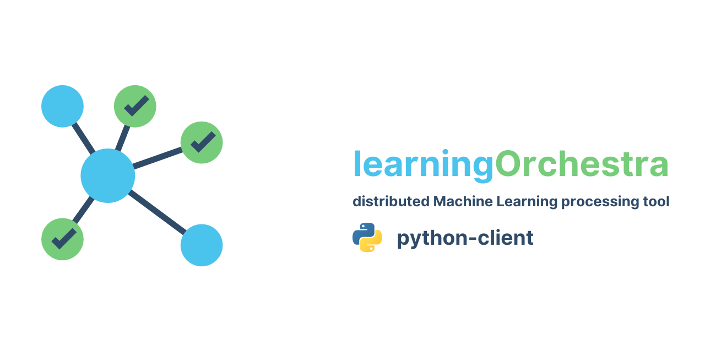

<p align="center">
    
    
    
    
</p>

# pythonClient

Python client for [learningOrchestra](https://github.com/learningOrchestra/learningOrchestra).

# Installation

Requires Python 3.x

```
pip install learning-orchestra-client
```

# Usage

Each interoperable REST API service described in Learning Orchestra is translated into Python. Details at [python client docs](https://learningorchestra.github.io/pythonClient/). Furthermore, some extra method calls are included into Python client API to simplify even more the Machine Learning services. For instance, the REST API is asynchronous, except for GET HTTP requests, but the Python client enables also the synchronous API calls. The wait API method, useful to receive notifications from ML pipes, is another important example to ilustrate an extension of the original REST API. 

# Learning Orchestra pipeline examples

* [Titanic.py](examples/titanic.py) is an example of a pipeline using the [Titanic Dataset](https://www.kaggle.com/c/titanic/overview):
* [IMDb.py](examples/sentiment_analysis.py) is an example of a pipeline using the [IMDb reviews](https://www.kaggle.com/avnika22/imdb-perform-sentiment-analysis-with-scikit-learn):
* [MNIST.py](examples/mnist_async.py) is an example of a pipeline using the [MNIST Dataset](http://yann.lecun.com/exdb/mnist/):


